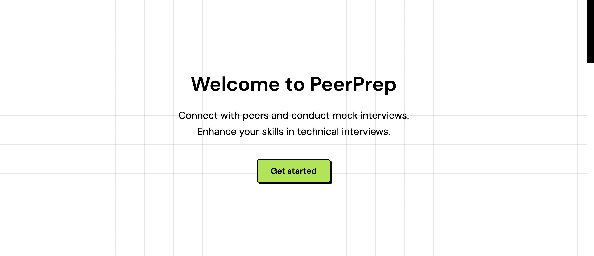

# PeerPrep

PeerPrep is a platform designed to help students connect with their peers and conduct mock interviews. This reciprocal process allows students to alternate between being an interviewer and an interviewee, enhancing their skills and confidence in technical interviews.

## Table of Contents

- [About the Project](#about-the-project)
- [Features](#features)
- [Contact](#contact)

## About the Project

PeerPrep aims to provide a collaborative environment where students can practice technical interviews, receive feedback, and improve their skills. The platform supports various types of technical challenges, including data structures, algorithms, frontend, and backend development.

## Features

- **Mock Interviews**: Practice technical interviews with peers to improve your skills and confidence.
- **Role Switching**: Alternate between being an interviewer and an interviewee to gain a comprehensive understanding of the interview process.
- **Technical Challenges**: Solve problems related to data structures, algorithms, frontend, and backend development.
- **Peer Feedback**: Receive constructive feedback from peers to identify areas of improvement.
- **Skill Development**: Enhance your technical and soft skills through regular practice and feedback.
- **Community Support**: Join a community of like-minded individuals focused on mutual growth and success.

## Contact

If you have any questions, suggestions, or feedback, please feel free to reach out. We are always happy to hear from our users and community members.

### Contact

- **Jitesh Khurana**
  - **Role**: Creator of PeerPrep, Final Year Student at Thapar University
  - **Email**: jiteshkhurana59@gmail.com
  - **LinkedIn**: [Jitesh Khurana](https://www.linkedin.com/in/jitesh-khurana/)
  - **Twitter**: [@jiteshKhurana12](https://twitter.com/jiteshKhurana12)
